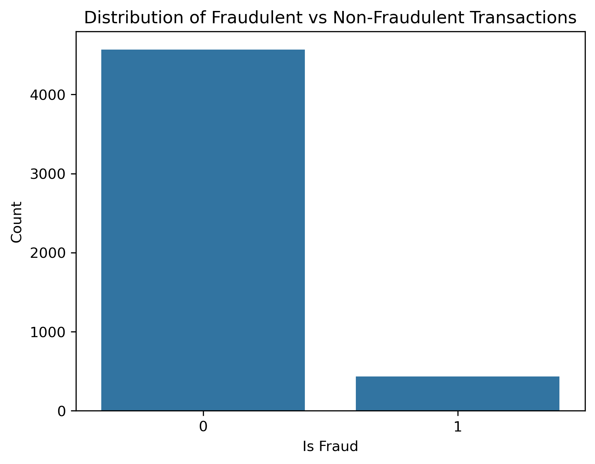
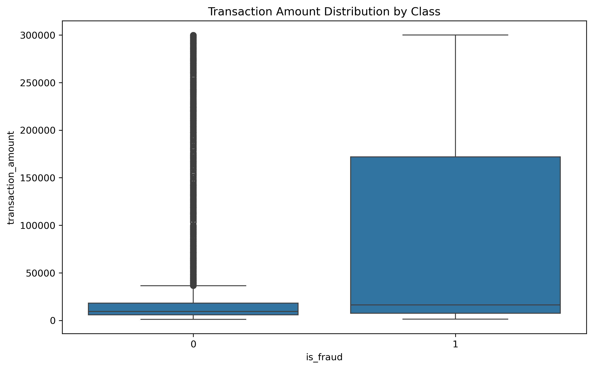
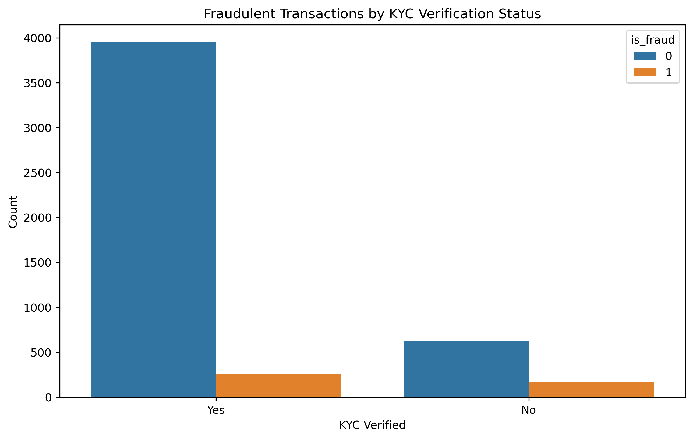
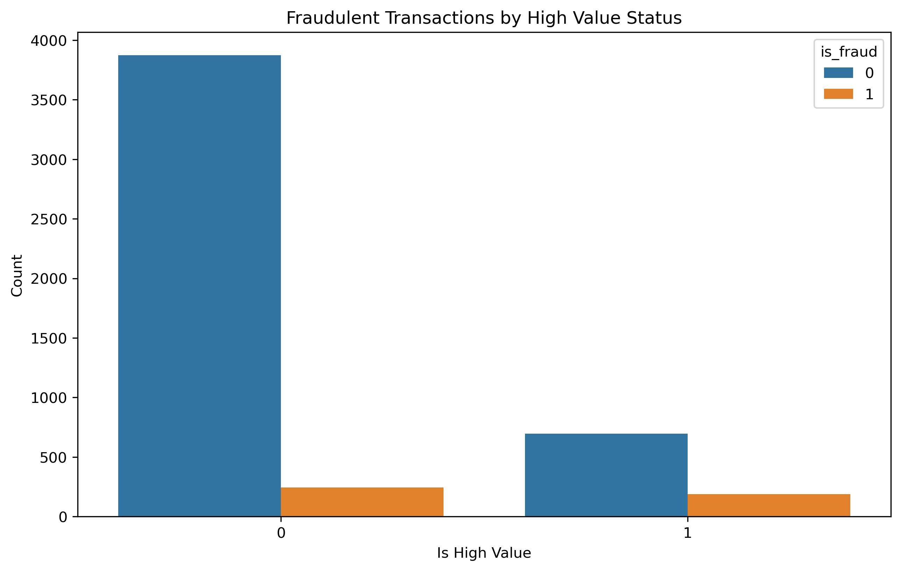
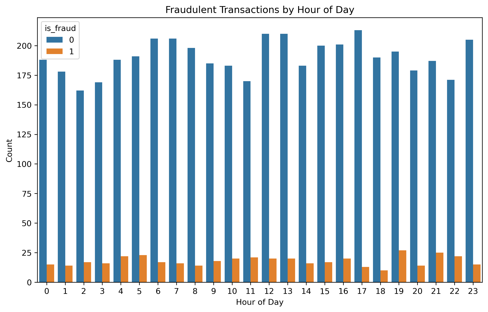
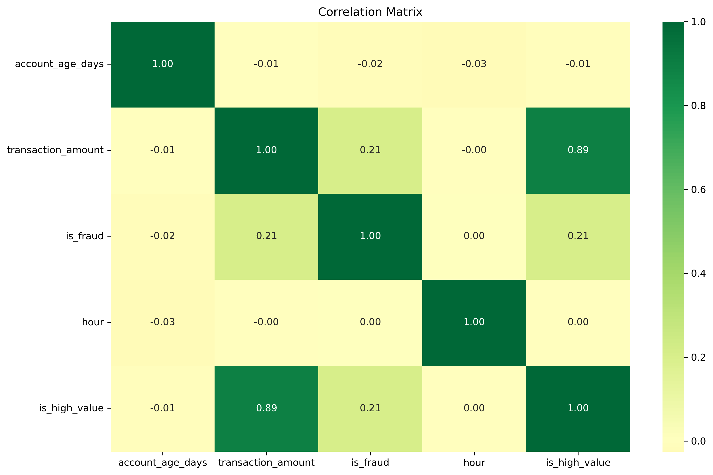

# EDA Summary of a Fraudulant Transactions dataset

The dataset that we have used for this project is Fraudulent2_processed.csv. The dataset consist of transactions records like  

1. transaction_id
2. customer_id
3. kyc_verified
4. account_age_days  
5.  transaction_amount  
6. channel  
7. timestamp
8. is_fraud  

The objective of this analysis is to explore the patterns and trends in fraudulant transactions.  
While exploring the dataset it was found to have no null values. After that all the duplicates were droped and the datatypes of the columns like timestamp, channel and transaction_amount were handled by converting the timestamp to datetime and transaction_amount to float.   

Once the cleaning was done, the new columns hour, day_of_week and is_high_value derived from timestamp and transaction_amount respectively were added in the raw dataset.  

Now on this cleaned and processed dataset we applied exploratory data analysis and fount that there were 91.36% transactions were genuine whereas 8.64% transactions were flagged as fraudulant. We can see that in the below graph.  

  

here on x-axis we have is_fraud flag and on y-axis we have the count of transactions.  

Now let us compare their box plots: 

The x-axis shows two groups:
- 0 → Non-fraudulent transactions
- 1 → Fraudulent transactions

The y-axis shows the transaction amount.

Each boxplot displays:
- The median (middle line inside the box)
- The interquartile range (the box)
- The overall spread of the data (whiskers)
- Outliers (individual points beyond whiskers)

The boxplot illustrates the distribution of transaction amounts split by fraudulent (1) and non-fraudulent (0) transactions. It reveals that fraudulent transactions generally involve much higher amounts compared to non-fraudulent ones. The median transaction amount for fraud cases is significantly larger, and the range of amounts in fraud transactions is much wider, reaching up to around 300,000. In contrast, non-fraudulent transactions tend to be lower in value, with a tighter interquartile range, though there are numerous outliers representing occasional high-value legitimate transactions. This clear difference in transaction amounts between the two classes suggests that transaction amount is a key feature that could help distinguish fraudulent activity from legitimate transactions.  

If we were to compare the rate of fraud transaction with kyc_status we would get the following graph:  

  

X-axis: Shows whether a transaction’s customer is KYC Verified ("Yes") or not ("No").
(KYC = Know Your Customer, a process of verifying identity.)  

Y-axis: Represents the count of transactions.

The bars are split by fraud status:

- Blue bars represent non-fraudulent transactions (is_fraud = 0).
- Orange bars represent fraudulent transactions (is_fraud = 1).

The bar plot compares fraudulent and non-fraudulent transactions based on the KYC verification status of customers. It shows that the majority of transactions come from KYC-verified customers. Although fraudulent transactions occur in both verified and non-verified groups, the proportion of fraud appears relatively higher among non-KYC-verified customers despite their lower overall transaction count. This suggests that lack of KYC verification may be associated with an increased risk of fraud, highlighting the importance of customer verification in fraud prevention.  

As we can see there are high value transactions too. If we compare them then we would get the graph below:  

X-axis: Indicates whether a transaction is classified as High Value (1) or not (0).

Y-axis: Shows the count of transactions.

Bars are color-coded by fraud status:

- Blue bars represent non-fraudulent transactions (is_fraud = 0).
- Orange bars represent fraudulent transactions (is_fraud = 1).  

This bar plot presents the distribution of fraudulent and non-fraudulent transactions based on whether transactions are classified as high value. The majority of transactions are low value, but the incidence of fraud is notably higher in high-value transactions. The similar counts of fraudulent and non-fraudulent transactions within the high-value group suggest that high-value transactions carry a greater risk of fraud. This highlights the importance of monitoring and scrutinizing high-value transactions more closely in fraud detection systems.  

Now comparing the number of frauds based on the hour of the day: 

  

Here the x-axis represents hours of a day from 0 to 23.  
And y-axis shows the number of transactions recorded during that hour.  

We can draw following conclusions from the graph:  

1. The graph compares legitimate vs fraudulent transactions for each hour of the day. 
2. Legitimate transactions remain high and stable across all 24 hours.  
3. Fraudulent transactions remain low but consistent, averaging around 10–25 per hour.  
4. Fraud tends to rise slightly during early morning (4 AM), noon to afternoon (12–14), and evening (19–21).  
5. There are no extreme peaks, meaning fraud attempts happen throughout the day without a clear single hotspot.  

Finally we will compare heatmap i.e. correlation matrix: 

 

This heatmap shows how strongly each pair of variables is related.
Values range from:

- +1 → perfect positive correlation  
- 0 → no correlation  
- −1 → perfect negative correlation  

The correlation analysis shows that most features in the dataset have very weak relationships with fraud. The only strong correlation observed is between transaction_amount and is_high_value, which is expected because high-value transactions are defined based on transaction amount. Fraud (is_fraud) displays only weak positive correlations with transaction amount and the high-value flag, indicating that fraudulent transactions tend to involve slightly higher amounts but not strongly enough to be reliable predictors on their own. Account age and transaction hour exhibit near-zero correlation with all variables, suggesting they do not influence fraudulent behavior. Overall, the dataset does not contain any single dominant indicator of fraud, emphasizing the need for multi-feature analysis and advanced modeling techniques to detect complex fraud patterns effectively